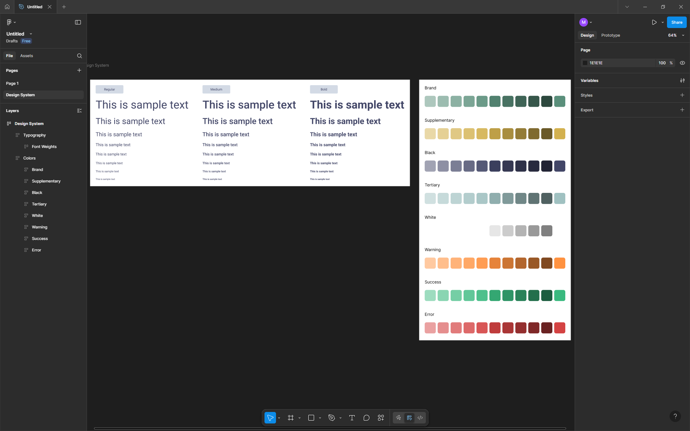
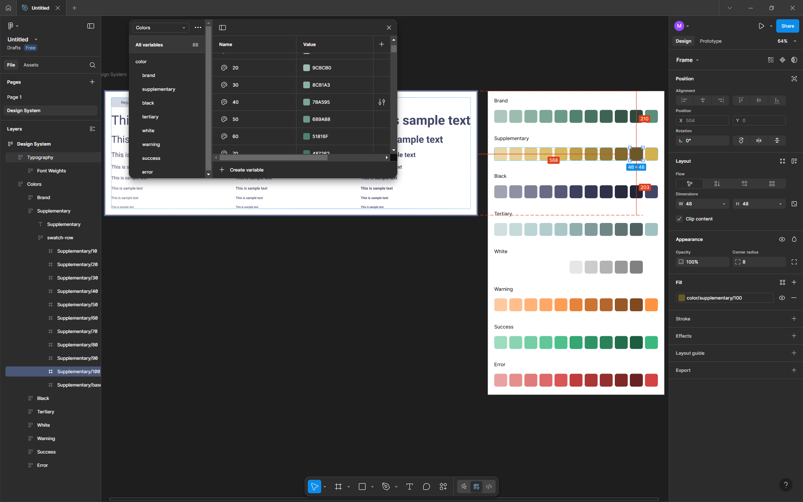

# Design System Importer

This workspace contains two Figma plugins for importing design tokens into local variable collections. They are designed to help move a design system from a simple configuration file into usable Figma variables with minimal manual setup.

## Project structure

- `Design System/` — a fuller importer that creates variables and a visual design-system page for previewing colors and type.
- `Variable Import/` — a lighter importer focused on local variables only.
- `public/` — screenshots used to preview the generated output.

## Plugins included

### 1. Design System

This plugin generates local Figma variables for:

- colors
- typography scales
- spacing values
- font styles and sample text

It also creates a dedicated page in the Figma document so you can inspect the system visually.

#### How to use

1. Open Figma.
2. Go to Plugins > Development > Import plugin from manifest...
3. Choose the `Design System/manifest.json` file.
4. Run the plugin from the plugin menu.
5. Edit the configuration at the top of `Design System/code.js` to match your brand.

#### Main configuration points

The `config` object in `Design System/code.js` controls:

- `colors` — generated shade scales for each base color
- `typography.fontFamily` — default font family
- `typography.fontStyles` — allowed Figma font styles
- `typography.fontSizes` and `lineHeights` — type scale
- `spacing` — spacing tokens
- `layout` — page sizing and preview spacing

This file also includes a `generateShades()` helper that turns a base hex color into a token scale like `10`, `20`, `30`, and so on up to `100`.

---

### 2. Variable Import

This plugin is the streamlined version for teams that only need local variables, without building a preview page.

#### How to use

1. Open Figma.
2. Go to Plugins > Development > Import plugin from manifest...
3. Choose the `Variable Import/manifest.json` file.
4. Run the plugin from the plugin menu.
5. Update the values in `Variable Import/code.js` to your design tokens.

#### Main configuration points

The top of `Variable Import/code.js` contains the editable setup for:

- `baseColors` — color tokens and semantic roles
- `fontFamily` — the typeface used for generated styles
- `fontSizes` — scale values for text sizes
- `letterSpacing` — letter spacing presets

This version is useful when you want a compact, variable-only import without the extra design-system UI.

---

## Customizing the design system

Both plugins follow the same pattern:

1. Define your base colors or semantic palette.
2. Adjust typography scale values.
3. Set spacing tokens.
4. Run the plugin in Figma.
5. Review the generated variables and update the configuration as needed.

A common workflow is to start with the colors and type scales in the `code.js` files, then load the plugin and refine the variables until they match your product system.

## Notes

- The plugin uses local Figma variables, which makes it easy to align the design system with the current file.
- The `Design System` plugin is the better choice when you want a visual reference page inside Figma.
- The `Variable Import` plugin is the better choice when you want a simpler, lighter import process.

## Recommended starting point

After setting up your colors, copy the const into the theme-demo file; There you can get a feel of the palette with ready made components and make any necessary adjustments if necessary.
